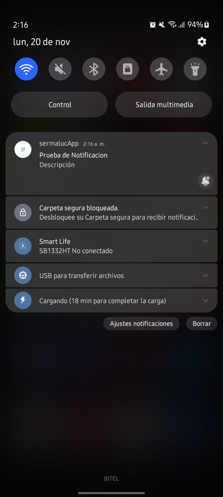

# Sermaluc Project APP

## Descripción
* Este proyecto es un App  implementado en Ionic con estas caracteristicas : 
Ionic:

   Ionic CLI                     : 6.20.1
   Ionic Framework               : not installed
   @angular-devkit/build-angular : 17.0.1
   @angular-devkit/schematics    : 17.0.1
   @angular/cli                  : 17.0.1
   @ionic/angular-toolkit        : 9.0.0

Capacitor:

   Capacitor CLI      : 5.5.1
   @capacitor/android : 5.5.1
   @capacitor/core    : 5.5.1
   @capacitor/ios     : not installed

## Arquitectura
* El proyecto utiliza una arquitectura modular con la siguiente estructura de carpetas:

- interfaces: Contiene la lógica de las interfaces del proyecto, como modelos o enums.
- pages/task: Directorio donde se encuentran los modulos funcionales del proyecto como (CREATE ,UPDATE, READ, DELETE).
- pages/task/services: Directorio para utilizar los servicios como LoaderService(Servicio para encender el loader y apagar), TaskService(Servicio para la realización de peticiones y acciones con el fire), tambien comunicación con el endpoint. 

## Deploy Android- iOS 
- Para utilizar este proyecto, debes instalar primero las dependencias y luego iniciar el servidor:

- npm install          # Instala todas las dependencias del proyecto
- ionic serve          # Inicia el app en modo desarrollo
- ionic build          # Para compilar todos los cambios en el proyecto
- npx cap add android  # Comando para generar la carpeta android, donde se contendra el apk al ser generado
- npx cap add ios      # Comando para generar la carpeta iOS, donde nos ayudará a generar el ipa
- npx cap open (ios - android) # Comando para abrir el motor por el cual sera generado el ipa o apk - android studio - xcode

## NOTAS 
- Para realizar esta prueba utilizamos un backend en node js que gracias a node-schedule podemos generar las tareas al servidor, luego al registrarnos en la base de datos en tiempo real de firebase también gracias a FCM enviamos una petición al servidor donde crea una notificación programada a la hora que el usuario indique. El backend se encuentra desplegado en la nube y el app funcional en android e iOS. Usamos Firebase Real Time Database, FCM. 

